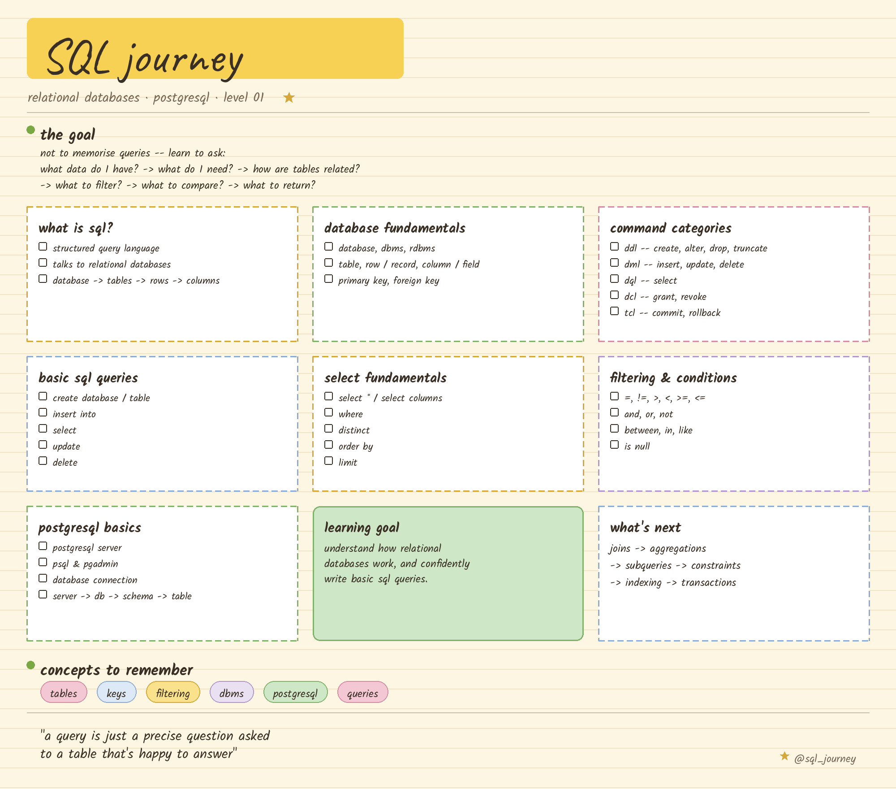

# 🗄️ SQL — Level 1: Foundations



Day 01 of my **#OneWeekChallenge** — building a strong foundation in SQL and relational databases with PostgreSQL, before moving to anything advanced.

> 📌 If you're doing your own One Week / 30 Days type challenge, feel free to use this repo's structure as a template — folder layout, README format, and the doodle-notes style are all reusable.

---

## 🎯 Goal of this level

Understand how relational databases actually work, and be able to confidently write basic SQL queries — without memorising, just by knowing *what to ask*:

`what data exists? -> what do I need? -> how are tables related? -> what to filter? -> what to return?`

---

## ✅ Topics covered

- [x] What SQL is & why it's used
- [x] Database fundamentals — Database, DBMS, RDBMS
- [x] Tables, Rows/Records, Columns/Fields
- [x] Primary Key & Foreign Key
- [x] SQL command categories — DDL, DML, DQL, DCL, TCL
- [x] `CREATE DATABASE`, `CREATE TABLE`
- [x] `INSERT INTO`, `SELECT`, `UPDATE`, `DELETE`
- [x] `SELECT *` vs specific columns
- [x] `WHERE`, `DISTINCT`, `ORDER BY`, `LIMIT`
- [x] Operators — `=`, `!=`, `>`, `<`, `>=`, `<=`
- [x] `AND`, `OR`, `NOT`
- [x] `BETWEEN`, `IN`, `LIKE`
- [x] `IS NULL` handling
- [x] PostgreSQL basics — `psql`, pgAdmin, database connections

---

## 📁 Folder contents

```
SQL/Level-1/
│
├── README.md                 → this file (concepts + notes)
├── sql-level-1-doodle.png    → hand-drawn style summary of the level
├── task.sql                  → practice questions/prompts  (adding soon)
└── solutions.sql             → my worked solutions          (adding soon)
```

> 🚧 **Task & Solutions:** I'm solving these in VS Code and will push `task.sql` and `solutions.sql` to this folder shortly. Until then, this README + the notes image cover everything I learned on Day 01.

---

## 🧠 How I'm using this repo

Every level/day in this challenge follows the same pattern so it's easy for anyone to follow along:

1. **Concepts** — what I studied (this README)
2. **Visual notes** — a doodle-style summary image for quick revision
3. **Practice** — `task.sql` with the questions I attempted
4. **Solutions** — `solutions.sql` with my worked answers
5. **What I learned / next step** — noted at the bottom of each level's README

---

## 🚀 What's next

`Level 1 (Foundations)` → **Joins** → **Aggregations** → **Subqueries** → **Constraints** → **Indexing** → **Transactions** → **Advanced PostgreSQL**

---

**Progress:** Level 1 — Foundations ✅

⭐ Found this useful for your own challenge? Feel free to fork the repo and adapt the structure.
